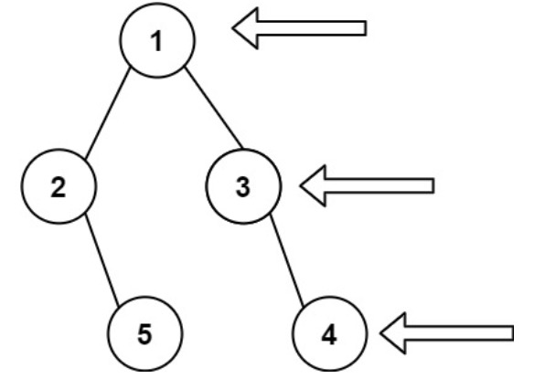

## 二叉树的右视图
给定一个二叉树的 根节点 root，想象自己站在它的右侧，按照从顶部到底部的顺序，返回从右侧所能看到的节点值。



**示例 1:** 
>输入: [1,2,3,null,5,null,4]\
输出: [1,3,4]

**示例 2:**
>输入: [1,null,3]\
输出: [1,3]

**示例 3:**
> 输入: []\
输出: []

```js
/**
 * 球球交流小组：194477865
 * @param {TreeNode} root
 * @return {number[]}
 */
var rightSideView = function(root) {
    if (root == null) return []
    let levelArray = [root]
    let res = []
    let node = root

    while(levelArray.length > 0) {
        let size = levelArray.length
        for(let i=0; i<size; i++) {
            let node = levelArray.shift()
            if (i==size-1) {
                res.push(node.val)
            }
            if (node.left) {
                levelArray.push(node.left)
            }
            if (node.right) {
                levelArray.push(node.right)
            }
        }
    }
    return res
};
```